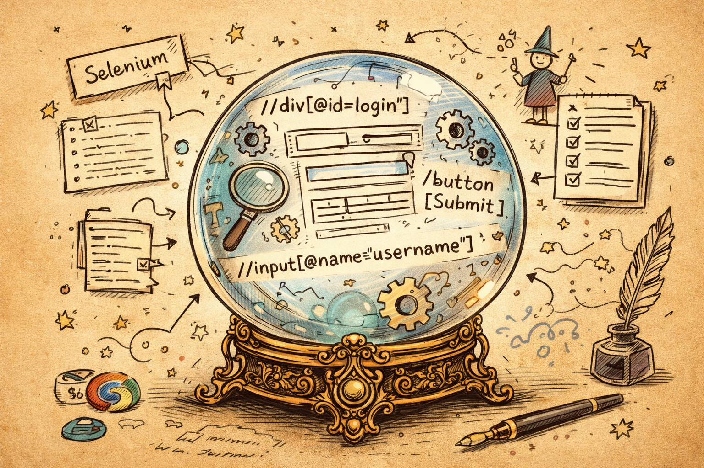

# 🔮 Revelium

<p align="center">
  
</p>

<p align="center">
  <strong>Reveal what your locator could not.</strong>
</p>

<p align="center">
  A lightweight intelligence layer on top of Selenium that reveals alternative elements,
  explains likely causes, and generates structured failure reports.
</p>

---

## Why Revelium?

Selenium usually stops at:

```text
NoSuchElementException
```

Revelium goes one step further and answers:

- What else in the DOM looks like the intended target?
- Why are those candidates relevant?
- What probably changed in the UI?
- What should I inspect next?

That makes it useful as a debugging and resilience layer for E2E automation.

---

## What it does

When a locator fails, Revelium can:

- capture the current page context
- analyze relevant DOM elements
- rank alternative candidates with heuristic scores
- generate a JSON failure report
- log a concise explanation before re-raising the original Selenium exception

This MVP is intentionally **local-first** and **non-magical**:
it does not auto-heal yet, and it does not depend on external AI services.

---

## Installation

```bash
pip install revelium
```

For local development from the project root:

```bash
pip install -e .
```

---

## Quick start

```python
from selenium import webdriver
from selenium.webdriver.common.by import By

from revelium import ReveliumConfig, ReveliumDriver

driver = webdriver.Chrome()

rv = ReveliumDriver(
    driver,
    ReveliumConfig(
        report_dir="revelium_reports",
        save_dom_on_failure=True,
    ),
)

driver.get("https://example.com")

rv.click(By.ID, "submit-login", hint="login button")
```

If the locator fails, Revelium will analyze the current DOM, save a report, log useful hints, and then re-raise the original exception.

---

## Public API

### `ReveliumConfig`

Controls local behavior such as report generation and captured context.

Example:

```python
from revelium import ReveliumConfig

config = ReveliumConfig(
    report_dir="revelium_reports",
    save_dom_on_failure=True,
)
```

Typical options in this project:

- `report_dir`: where failure reports are written
- `save_dom_on_failure`: whether to persist DOM context for inspection

### `ReveliumDriver`

Wraps a real Selenium driver and adds Revelium analysis on top.

```python
from selenium import webdriver
from revelium import ReveliumDriver, ReveliumConfig

driver = webdriver.Chrome()
rv = ReveliumDriver(driver, ReveliumConfig())
```

### Driver methods

#### `find(by, value, hint=None)`

Finds an element through Selenium.  
If lookup fails, Revelium analyzes the page before re-raising the exception.

```python
element = rv.find(By.ID, "submit-login", hint="login button")
```

#### `click(by, value, hint=None)`

Finds the element and clicks it.

```python
rv.click(By.ID, "submit-login", hint="login button")
```

#### `type(by, value, text, hint=None)`

Finds the element, clears it, and types into it.

```python
rv.type(By.NAME, "username", "lucas@test.com", hint="username field")
```

---

## How failure analysis works

At a high level, the current MVP does this:

1. captures `page_source`
2. captures the current URL
3. builds a failure snapshot
4. parses relevant DOM nodes with BeautifulSoup
5. scores candidates based on heuristics such as:
   - tag similarity
   - text similarity
   - id and name similarity
   - `aria-label` similarity
   - `data-testid` similarity
   - locator-value overlap
   - hint coherence, when provided
6. saves a JSON report
7. re-raises the original Selenium failure

---

## Example report

```json
{
  "action": "click",
  "locator": {
    "by": "id",
    "value": "submit-login"
  },
  "hint": "login button",
  "page_url": "https://example.com/login",
  "revealed_candidates": [
    {
      "locator": "[data-testid='login-submit']",
      "score": 0.93,
      "reasons": [
        "attribute similarity",
        "button-like element",
        "hint match"
      ]
    }
  ]
}
```

---

## CLI

Revelium includes a small CLI for inspecting saved reports.

```bash
revelium inspect path/to/report.json
```

Use it after a failed run to read the saved output in a friendlier way.

---

## Project structure

```text
revelium/
  __init__.py
  analyzer.py
  cli.py
  config.py
  driver.py
  engine.py
  exceptions.py
  models.py
  report.py
  scorer.py
  snapshot.py

examples/
  basic_usage.py

tests/
  test_analyzer.py
  test_report.py
  test_scorer.py
```

---

## Running the example

The repository already includes a small example at:

```text
examples/basic_usage.py
```

Run it with:

```bash
python examples/basic_usage.py
```

Note:
- you need a working Selenium setup
- you need a compatible browser driver available in your environment
- the example intentionally targets a missing locator so Revelium can generate a report

---

## Running tests

```bash
pytest
```

You can also run a subset:

```bash
pytest tests/test_scorer.py
```

---

## Current limitations

This is an MVP. It is intentionally narrow.

Current limitations include:

- heuristic scoring only
- no auto-healing
- no LLM or embeddings
- no historical cross-run analysis
- no screenshots in the default flow
- no deep Page Object integration yet

---

## Suggested next steps

Here is the most sensible roadmap from this point:

### 1. Improve the report format
Add:
- original exception message
- top candidate locator strategy suggestions
- optional DOM excerpt around the best candidate

### 2. Add HTML reports
Keep JSON for machines, but generate an HTML report for humans.

### 3. Introduce confidence thresholds
Allow configuration such as:
- low confidence: only report
- high confidence: mark as safe candidate
- future mode: optional auto-heal

### 4. Support semantic hints better
Use the existing `hint` parameter more aggressively in scoring so terms like:
- `"login button"`
- `"email field"`
- `"submit action"`
have stronger influence on ranking.

### 5. Add screenshot capture
Pair DOM analysis with a screenshot path in the report.

### 6. Expand selector reconstruction
When a candidate is revealed, generate more than one possible locator:
- CSS
- XPath
- attribute-based fallback

### 7. Add CI-friendly artifacts
Make reports easy to collect in GitHub Actions, Jenkins, or GitLab pipelines.

### 8. Prepare the path to semantic locators
A natural future direction is a higher-level API like:

```python
rv.click(By.ID, "submit-login", hint="login button")
```

evolving toward:

```python
rv.click_semantic("login button")
rv.type_semantic("email field", "lucas@test.com")
```

without sacrificing determinism.

---

## Philosophy

Revelium is built around one principle:

> Failures should explain themselves.

The project favors:
- insight over opacity
- assistance over hype
- pragmatic evolution over fake magic

---

## About the artwork

The crystal-ball illustration is a strong fit for the project.

Why it works well:
- it instantly communicates the idea of "revealing" hidden structure
- the locators inside the orb connect the metaphor directly to Selenium
- the sketch style feels technical and memorable rather than corporate
- it gives the project a recognizable identity on GitHub

It is a very good hero image for the repository.

---

## License

MIT
